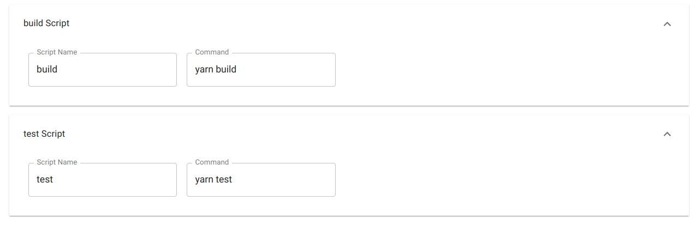

# Cirrus Builder Tutorial

Here is a basic tutorial on how to use the Cirrus CI Configuration Builder.
For this example, we are going to be making a configuration that (would) build and test a React app.

## Starting

To start off, you will need to head to [cirrusbuilder.rdil.rocks](https://cirrusbuilder.rdil.rocks/).
Your screen should look like something like this:

## Naming the Task

Next, we will want to title our task. To do so, we will type a name into the ==Task Name== box.

## Configuring Container

Because we want to create a Node.js build/test task, we can just use the premade Node.js Docker image as a container:

## Adding a Cache

Because React apps tend to have a lot of dependencies, we will want to make sure to cache them.
You will want to select the add cache button:

After clicking it, you will see a new pop-out drawer has appeared:

Clicking on which shows you a lot of new options that need to filled out:

Here is what it looks like after being completed:

After you finish filling it out, you can close the drawer if you want, and then continue to the next section, where we add our scripts.

## Adding Scripts

Now that we have all our dependencies set to install, we need to actually run the building and testing!

We will proceed by repeating the same creation steps as before, instead this time we are going to select a script.

Once opened, your new drawer should look like this:

Which is a lot easier to fill out.

This can also easily be repeated with a `test` instruction (assuming the first one is the `build` instruction).

In the end, the drawers look like this:

By now, we are done adding scripts. Time to get the generated YAML for your repository!

## Exporting

To finalize the configuration, simply press the export button.

You can finish off by copying the YAML from the text editor into your repository's `.cirrus.yml` file - and committing.
